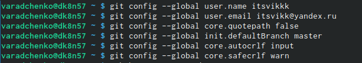
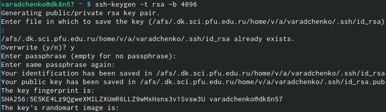
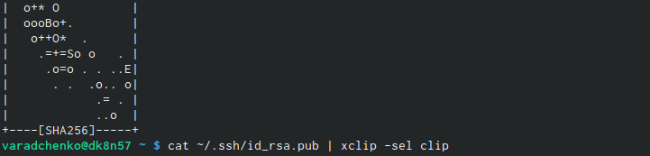
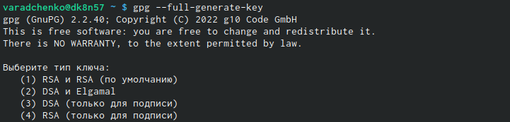
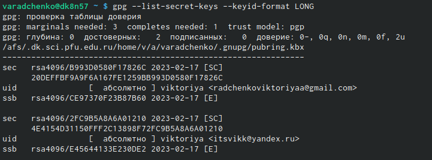
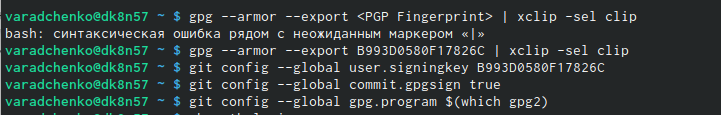
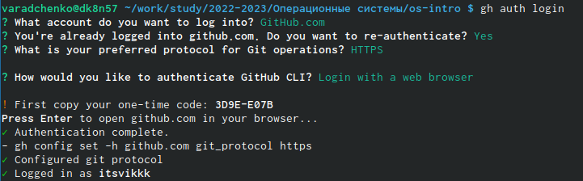
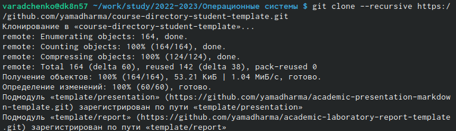
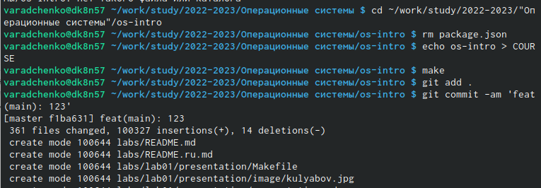

---
## Front matter
title: "Лабораторная работа №2"
subtitle: "Операционные системы"
author: "Виктория Андреевна Радченко"

## Generic otions
lang: ru-RU
toc-title: "Содержание"

## Bibliography
bibliography: bib/cite.bib
csl: pandoc/csl/gost-r-7-0-5-2008-numeric.csl

## Pdf output format
toc: true # Table of contents
toc-depth: 2
lof: true # List of figures
lot: true # List of tables
fontsize: 12pt
linestretch: 1.5
papersize: a4
documentclass: scrreprt
## I18n polyglossia
polyglossia-lang:
  name: russian
  options:
	- spelling=modern
	- babelshorthands=true
polyglossia-otherlangs:
  name: english
## I18n babel
babel-lang: russian
babel-otherlangs: english
## Fonts
mainfont: PT Serif
romanfont: PT Serif
sansfont: PT Sans
monofont: PT Mono
mainfontoptions: Ligatures=TeX
romanfontoptions: Ligatures=TeX
sansfontoptions: Ligatures=TeX,Scale=MatchLowercase
monofontoptions: Scale=MatchLowercase,Scale=0.9
## Biblatex
biblatex: true
biblio-style: "gost-numeric"
biblatexoptions:
  - parentracker=true
  - backend=biber
  - hyperref=auto
  - language=auto
  - autolang=other*
  - citestyle=gost-numeric
## Pandoc-crossref LaTeX customization
figureTitle: "Рис."
tableTitle: "Таблица"
listingTitle: "Листинг"
lofTitle: "Список иллюстраций"
lotTitle: "Список таблиц"
lolTitle: "Листинги"
## Misc options
indent: true
header-includes:
  - \usepackage{indentfirst}
  - \usepackage{float} # keep figures where there are in the text
  - \floatplacement{figure}{H} # keep figures where there are in the text
---

# Цель работы

Изучить идеологию и применение средств контроля версий. Освоить умения по работе с git.

# Выполнение лабораторной работы

1. Базовая настройка git. Зададим имя и email владельца репозитория. Настроим utf-8 в выводе сообщений git. Зададим имя начальной ветки. Параметр autocrlf и safecrlf.

{#fig:001 width=90%}

2. Создание ssh ключа по алгоритму rsa с ключём размером 4096 бит

{#fig:002 width=90%}

3. Копирование ключа

{#fig:003 width=90%}

4. Генерируем ключ gpg

{#fig:004 width=90%}

5. Выводим список ключей и копируем отпечаток приватного ключа

{#fig:005 width=90%}

6. Добавление PGP ключа в GitHub.Используя введёный email, укажите Git применять его при подписи коммитов

{#fig:006 width=90%}

7. Авторизация для настройки gh

{#fig:007 width=90%}

8. Создание репозитория курса на основе шаблона

{#fig:008 width=90%}

9. Создание необходимых каталогов

{#fig:009 width=90%}

10. Отправка файлов на сервер

{#fig:010 width=90%}

# Выводы

В ходе работы я изучила идеологию и применение средств контроля версий и освоила умения по работе с git.

# Список литературы{.unnumbered}

::: {#refs}
:::
